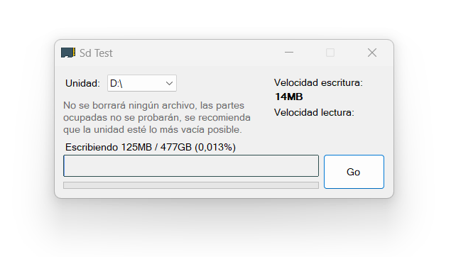

# SdTester
A basic SD card tester in C#.

With multi language interface.

To bypass cache the program generates a file merging 4 random data patterns, the file occupies all the avilable space on the drive and later is verified.
The big progress bar fills 2 times, one for writing in blue, other with verification in green if ok or red if pattern does not match.
The second thinnest progressbar is the overall progress.
